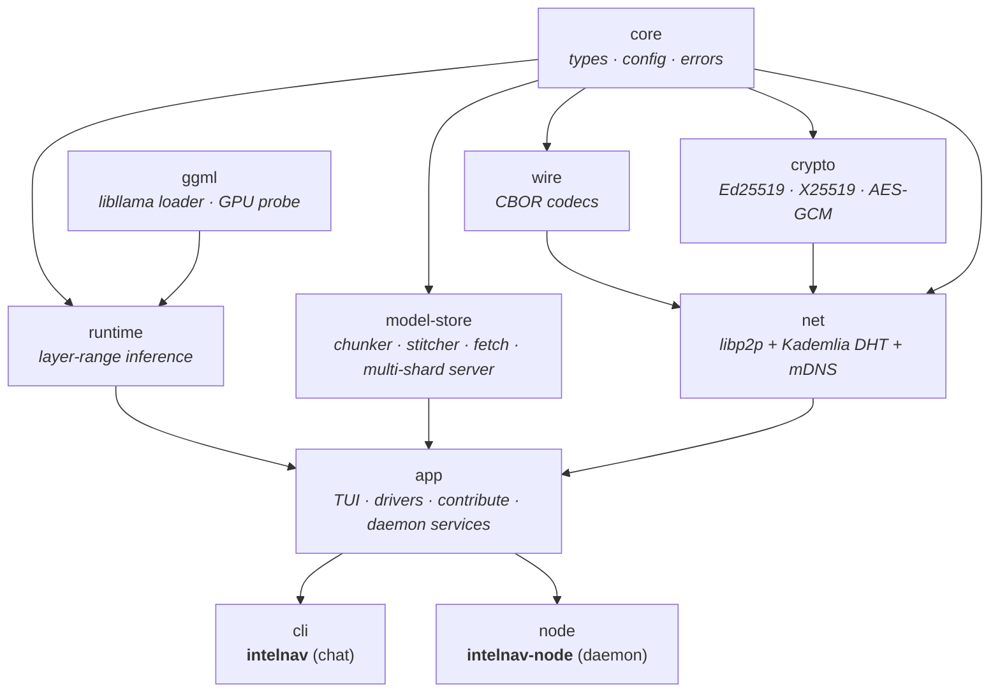
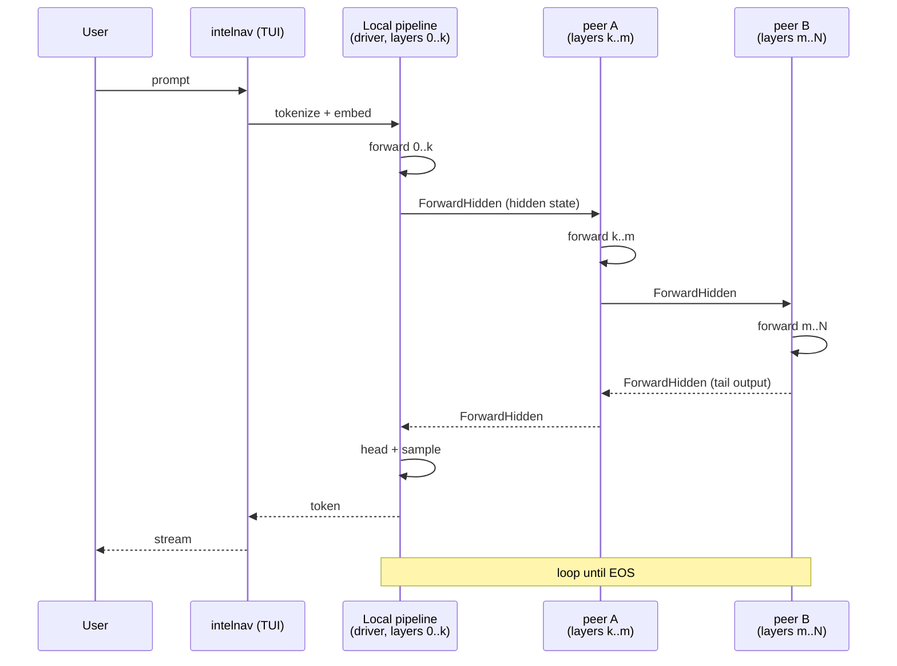

# Architecture

## Workspace shape

`core` is the foundation: shared types, config, errors, no heavy
deps. `wire` and `crypto` build on it. `net` does peer discovery
(mDNS, libp2p) and the Kademlia shard index. `runtime` and `ggml`
handle layer-range inference. `model-store` is the chunker /
stitcher / fetcher / multi-shard chunk HTTP server.

`app` is the substantive layer — every module that isn't a leaf
crate or a binary lives here. It's a library so two binaries can
share it: `cli` is the chat client, `node` is the host daemon.

The user-facing modules in `app` are:

- `firstrun` / `bootstrap` — auto-generate config, fetch seeds.
- `gate` — mandatory contribution gate with hardware-fit suggestion.
- `swarm_node` — daemon spawn (libp2p + announce loop + drain
  watchdog + chunk + forward + control RPC, all in-process).
- `forward_server` — inference TCP listener with control-state
  gating; refuses new chains on Draining/Stopped slices.
- `chain_driver` — multi-candidate `ChainTarget` with per-hop
  failover ranked by TCP probe latency.
- `control` — Unix-socket RPC between TUI and daemon.
- `service` — pkexec-driven systemd user-unit installer.

## Two binaries, one library

The split exists so closing the chat window can't take you off the
swarm. The chat binary:

- Spawns a *client-only* libp2p host (DHT queries, no announce loop).
- Reads the DHT on `/models` to populate swarm rows.
- Hands off contribute requests to `intelnav-node` via shared on-disk
  state (`<models_dir>/.shards/*/kept_ranges.json`).

The node binary:

- Spawns a full libp2p host with announce loop.
- Scans `<models_dir>/.shards/*/kept_ranges.json` on boot.
- Publishes one `(model_cid, layer_range) → ProviderRecord` to the
  DHT for every slice in those sidecars.
- Re-announces every 5 minutes (Kademlia provider TTL is 30 min).
- Hosts the chunk HTTP server and the inference forward TCP listener
  in-process so other peers can pull our bundles or include us in a
  chain. No separate sidecar processes.

## Runtime data flow

A single chat turn:

The driver owns the embedding + the front slice + the head. Hidden
states travel through the chain in CBOR-framed `ForwardHidden`
messages. Each peer keeps its own KV cache for the session;
`SessionInit` resets it at the start of each turn.

## DHT shard index

Two record types live on Kademlia:

1. **Provider record** — keyed by `blake3("intelnav/shard/v1|<cid>|<start>|<end>")`.
   Value is a CBOR-encoded `ProviderRecord` carrying the peer id,
   listen multiaddrs, optional `chunks_url` (chunk-server `host:port`),
   optional `manifest_cid` (so a fresh peer can reconstruct the
   manifest URL), and optional `forward_url` (for inference).

2. **Model envelope** — keyed by `blake3("intelnav/model/v1|<cid>")`.
   Value is a CBOR-encoded `ModelEnvelope` with display name, arch,
   block count, and a quant tag. Lets a peer that only knows the
   cid render a useful row in the picker.

Multiple peers can PUT under the same key — Kademlia stores them as
separate records, so the consumer's `get_record` returns each one
during the iterative walk. The consumer dedupes on `peer_id` and
freshness-ranks on `minted_at`.

## Onboarding paths

The `/models` picker in the TUI surfaces three sources:

- **Local.** GGUFs cached in `models_dir`. `Enter` runs them in
  process via `LocalDriver`.
- **Swarm.** Models the DHT advertises slices for. `Enter` builds a
  `ChainTarget` by greedy-picking one provider per range and hands
  it to `ChainDriver`. `c` triggers the *swarm pre-split* contribute
  path (pull just one range's chunks via `fetch_manifest_only` +
  `fetch_chunks`).
- **Hub.** Curated HuggingFace catalog. `Enter` downloads the full
  GGUF. `c` triggers the *hub → split → host* path (download, run
  the chunker, write a `kept_ranges.json` sidecar).

In both contribute paths the end state is the same: a directory at
`<models_dir>/.shards/<cid>/` with `manifest.json` + `chunks/*.bin` +
`kept_ranges.json`. The `intelnav-node` daemon reads the sidecar and
takes care of announcing.

## Identity

A single Ed25519 seed in `~/.local/share/intelnav/peer.key` drives
both the wire-layer signature and the libp2p peer id (via
`identity_to_keypair`). The chat client and the node daemon load the
same file, so they show up to the rest of the swarm as the same
peer with the same id — no double identity.
